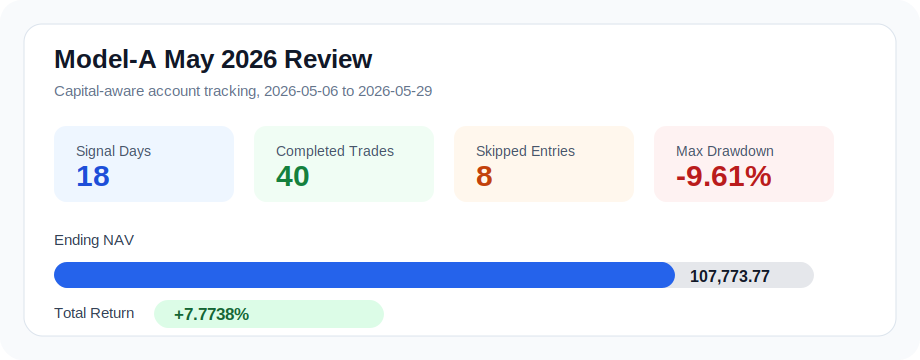
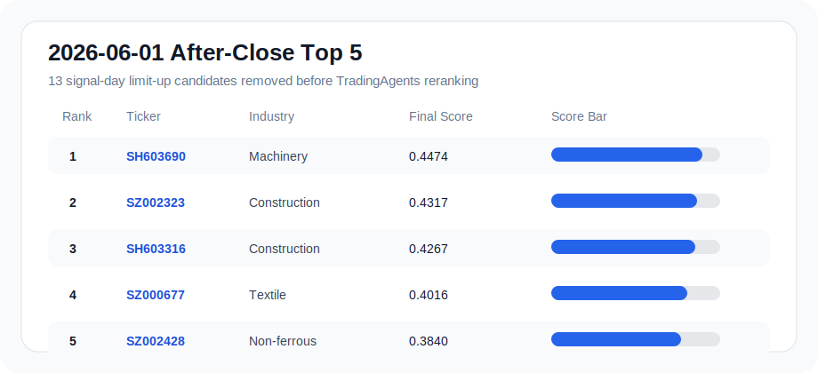

# QuantLab Model-A After-Close Signals

[中文](#中文说明) | [English](#english)

This release package is for reading the daily after-close Model-A signal output. It contains static HTML dashboards, published signal data, and summary charts. It does not include raw market data, model checkpoints, or private runtime assets.

## 中文说明

### 这是什么

这是 QuantLab 的 5 分钟线 Model-A 盘后选股发布包。每天收盘后，流程会使用当日 15:00 的 5 分钟 Kronos 结果生成候选池，再由 TradingAgents 风格的二级分析模块给出最终观察名单。

最核心的入口是月度盘后看板：

- 2026 年 5 月回顾：[frontend/tradingagents_modela_ui_20260501_20260529/index.html](frontend/tradingagents_modela_ui_20260501_20260529/index.html)
- 2026 年 6 月每日更新：[frontend/tradingagents_modela_ui_202606/index.html](frontend/tradingagents_modela_ui_202606/index.html)
- 2026-06-01 单日页面：[frontend/tradingagents_modela_ui_202606/2026-06-01.html](frontend/tradingagents_modela_ui_202606/2026-06-01.html)

> 使用方式：克隆仓库后，直接用浏览器打开对应 `index.html`。页面是静态 HTML，CSS 已内联，可离线查看。

### 5 月表现摘要

5 月页面覆盖 2026-05-06 至 2026-05-29，共 18 个可用交易日。账户口径使用资金占用后的结果：持仓未退出时不重复开新仓，因此比“每天独立篮子”更接近真实账户路径。



| 指标 | 结果 |
| --- | ---: |
| 覆盖交易日 | 18 |
| 实际入场日 | 16 |
| 完成交易 | 40 |
| 因资金占用跳过 | 8 |
| 初始资金 | 100,000 |
| 期末净值 | 107,773.7734 |
| 5 月总收益 | 7.7738% |
| 最大回撤 | -9.6090% |

重要说明：旧的 `daily_basket_returns.csv` 只是每日独立信号诊断，不能作为账户级收益引用。本发布包引用的是资金占用后的账户跟踪口径。

### 最新盘后结果：2026-06-01

6 月 1 日的 15:00 收盘推理已经生成，并进入 6 月发布看板。Model-A top20 中有 13 个候选因“信号日 15:00 已涨停”被过滤，剩余候选进入 TradingAgents 二级分析，最终形成下面的 top5。



| 最终排名 | 股票 | 行业 | Model-A 排名 | 最终分 | 风险 |
| ---: | --- | --- | ---: | ---: | --- |
| 1 | SH603690 | 机械设备 | 2 | 0.4474 | 低 |
| 2 | SZ002323 | 建筑装饰 | 4 | 0.4317 | 低 |
| 3 | SH603316 | 建筑装饰 | 6 | 0.4267 | 低 |
| 4 | SZ000677 | 纺织服饰 | 5 | 0.4016 | 低 |
| 5 | SZ002428 | 有色金属 | 1 | 0.3840 | 低 |

对应数据文件：

- [data/tradingagents_modela_rerank_202606/2026-06-01_ranked.csv](data/tradingagents_modela_rerank_202606/2026-06-01_ranked.csv)
- [data/tradingagents_modela_rerank_202606/2026-06-01_analysis.json](data/tradingagents_modela_rerank_202606/2026-06-01_analysis.json)
- [data/tradingagents_modela_rerank_202606/2026-06-01_signal_limit_up_removed.csv](data/tradingagents_modela_rerank_202606/2026-06-01_signal_limit_up_removed.csv)

### 每天盘后怎么更新

维护者每天收盘后运行仓库脚本生成当月页面。脚本会先检查并补齐 5 分钟数据和 15:00 Kronos 结果，然后重建当月发布目录：

```bash
python scripts/run_modela_daily_release_after_close.py --date YYYY-MM-DD --gpu 0
```

生成结果按月份累计：

```text
quantlab/trading_strategy_release/data/tradingagents_modela_rerank_YYYYMM/
quantlab/trading_strategy_release/data/5min_modela_portfolio_backtest_YYYYMM/
quantlab/trading_strategy_release/frontend/tradingagents_modela_ui_YYYYMM/
```

### 风险提示

本发布包用于研究和复盘，不构成投资建议。盘后信号默认不按信号日收盘价成交，实际交易口径从下一交易日 09:35 开始跟踪；新信号日尚未产生完整成交和退出时，账户收益文件可能为空或显示待跟踪。

## English

### What This Is

This is the QuantLab 5-minute Model-A after-close signal release. After each market close, the pipeline reads the 15:00 Kronos outputs, builds a Model-A candidate pool, and applies a TradingAgents-style second-stage analyst module to produce the final watchlist.

Main dashboards:

- May 2026 review: [frontend/tradingagents_modela_ui_20260501_20260529/index.html](frontend/tradingagents_modela_ui_20260501_20260529/index.html)
- June 2026 daily updates: [frontend/tradingagents_modela_ui_202606/index.html](frontend/tradingagents_modela_ui_202606/index.html)
- 2026-06-01 daily page: [frontend/tradingagents_modela_ui_202606/2026-06-01.html](frontend/tradingagents_modela_ui_202606/2026-06-01.html)

Usage: clone the repository and open the corresponding `index.html` in a browser. The dashboards are static HTML files and can be viewed offline.

### May 2026 Performance Summary

The May dashboard covers 18 available trading days from 2026-05-06 to 2026-05-29. Performance is reported with capital occupancy: when capital is already tied up in an open basket, later signals are skipped instead of opening another independent basket.


| Metric | Result |
| --- | ---: |
| Covered signal days | 18 |
| Entry days | 16 |
| Completed trades | 40 |
| Skipped entries | 8 |
| Initial capital | 100,000 |
| Ending NAV | 107,773.7734 |
| May total return | 7.7738% |
| Max drawdown | -9.6090% |

Important: the older `daily_basket_returns.csv` is only an independent daily basket diagnostic. It should not be quoted as account-level performance. This release uses the capital-aware account tracking view.

### Latest After-Close Output: 2026-06-01

The 2026-06-01 15:00 close signal has been generated and published in the June dashboard. From the Model-A top20 candidate pool, 13 signal-day limit-up names were removed before the second-stage analysis. The remaining candidates were reranked by the TradingAgents module.


| Final Rank | Ticker | Industry | Model-A Rank | Final Score | Risk |
| ---: | --- | --- | ---: | ---: | --- |
| 1 | SH603690 | Machinery | 2 | 0.4474 | Low |
| 2 | SZ002323 | Construction Decoration | 4 | 0.4317 | Low |
| 3 | SH603316 | Construction Decoration | 6 | 0.4267 | Low |
| 4 | SZ000677 | Textile & Apparel | 5 | 0.4016 | Low |
| 5 | SZ002428 | Non-ferrous Metals | 1 | 0.3840 | Low |

Published data:

- [data/tradingagents_modela_rerank_202606/2026-06-01_ranked.csv](data/tradingagents_modela_rerank_202606/2026-06-01_ranked.csv)
- [data/tradingagents_modela_rerank_202606/2026-06-01_analysis.json](data/tradingagents_modela_rerank_202606/2026-06-01_analysis.json)
- [data/tradingagents_modela_rerank_202606/2026-06-01_signal_limit_up_removed.csv](data/tradingagents_modela_rerank_202606/2026-06-01_signal_limit_up_removed.csv)

### Daily Update Flow

Maintainers update the monthly dashboard after market close with:

```bash
python scripts/run_modela_daily_release_after_close.py --date YYYY-MM-DD --gpu 0
```

The generated artifacts are accumulated by month:

```text
quantlab/trading_strategy_release/data/tradingagents_modela_rerank_YYYYMM/
quantlab/trading_strategy_release/data/5min_modela_portfolio_backtest_YYYYMM/
quantlab/trading_strategy_release/frontend/tradingagents_modela_ui_YYYYMM/
```

### Risk Notice

This package is for research and review only. It is not investment advice. After-close signals are not assumed to trade at the signal-day close; execution tracking starts from the next trading day 09:35. For a newly generated signal day, completed trade and account return files may be empty until later market data becomes available.
